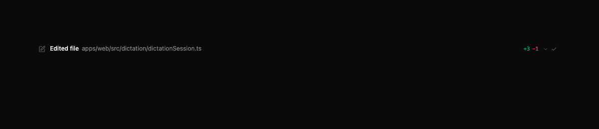

# Reading the chat timeline

T3 Code shows tool activity alongside messages so you can follow what the agent is doing. File
edits include the affected path and line-change counts when the provider reports them.

Paths inside the active project or worktree are shown relative to that workspace. The generated
worktree directory is omitted because the thread already provides that context.

Source paths written in messages may become clickable file chips. Opening a chip uses its full
resolved path, while its label and **Copy relative path** action stay workspace-relative.
