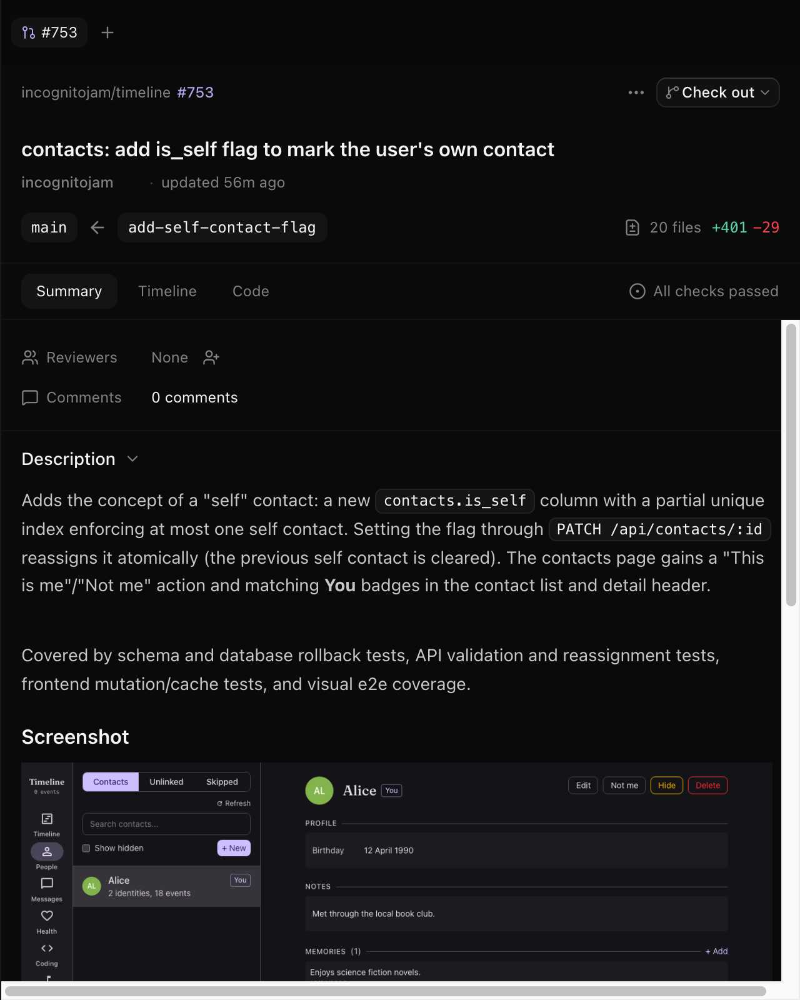
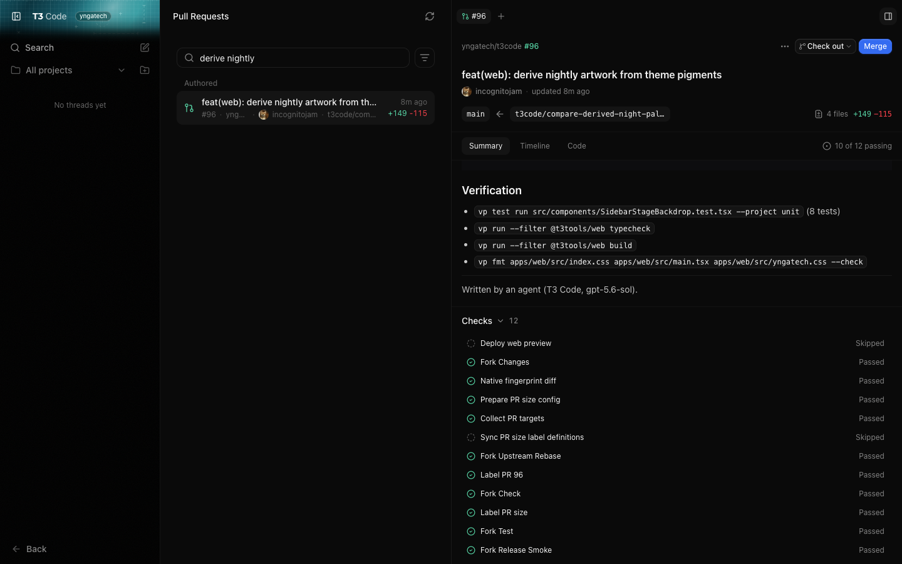
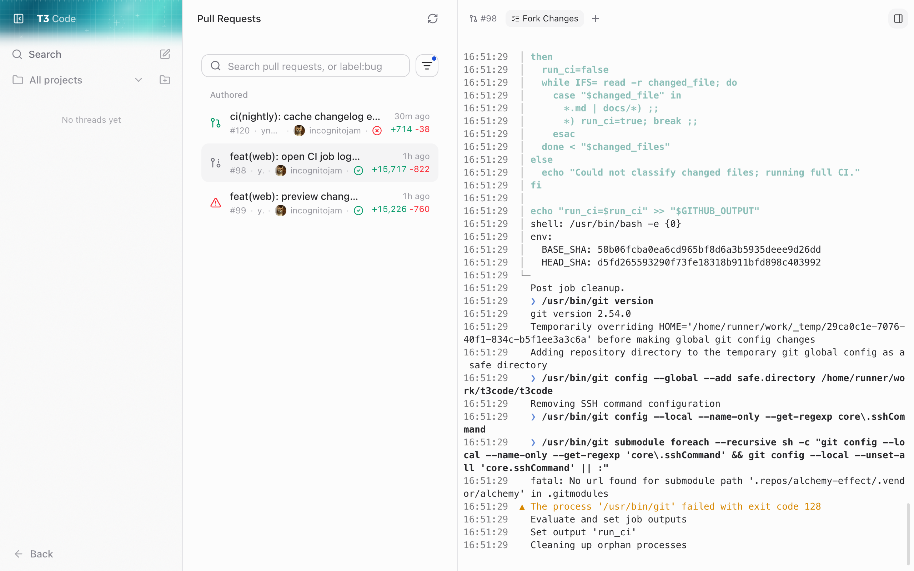
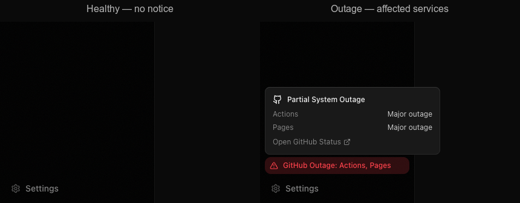

# Source Control Integrations

T3 Code connects to your Git hosting provider so you can create pull requests, review code, and manage repositories without leaving the app.

## Supported Providers

T3 Code works with the platforms your team already uses:

- **GitHub** – Pull requests, repository creation, and clone integration
- **GitLab** – Merge requests, repository publishing, and hosted clones
- **Bitbucket** – Pull request workflows (via API token authentication)
- **Azure DevOps** – Pull request support for Microsoft-hosted repositories

## What You Can Do

### Start Projects from Anywhere

**Clone repositories directly**

- Open the Command Palette (`Cmd/Ctrl + K`) → **Add Project**
- Choose **GitHub repository**, **GitLab repository**, **Bitbucket repository**, **Azure DevOps repository**, or paste any **Git URL**
- Enter the repository path (`owner/repo`, `group/project`, `workspace/repository`, or `project/repository`) or a full Git URL, pick a destination, and start coding

**Publish local projects to the cloud**

- Have a local Git repository without a remote?
- Use the **Publish Repository** action to create a new hosted repository (GitHub, GitLab, Bitbucket, or Azure DevOps), add it as your origin remote, and push, in one flow
- If the local repository has no commits yet, publishing creates the remote and wires it up but does not push. Make a commit, then push normally.

### Manage Code Reviews Without Context Switching

**Create pull requests while you work**

- Push a branch and create a pull request from the Git actions controls in the toolbar
- T3 Code can suggest titles and descriptions based on your commits
- Supports GitHub Pull Requests, GitLab Merge Requests, Bitbucket Pull Requests, and Azure DevOps Pull Requests

**Stay on top of open reviews**

- See if your current branch already has an open PR/MR
- Open several reviews from the **Pull requests** page as tabs in the right panel
- Read ordinary files expanded by default in **Code changes**; oversized files stay folded until
  opened, while files with review comments remain expanded
- View repository-hosted images in GitHub pull request descriptions, including private repositories
- While working in a thread, open linked reviews in the same compact right-panel tabs without
  leaving the conversation
- Select a GitHub Actions check to open its job in a terminal tab beside the review. The terminal
  presents live step progress while the job is running, then replaces it with the selected job's
  raw log with scannable steps, commands, warnings, and errors. Checks from other services open on
  their host.
- Open the review directly in your browser with one click
- Command-click (Control-click on Windows and Linux) a pull request number in the sidebar to open it in your browser instead of in T3 Code
- Check out a teammate's branch to review code locally

**Fix what you wrote, in place**

- Rewrite a pull request's title and description from the review itself, in Markdown, with a
  preview before you save
- Rewrite your own comments the same way, wherever they are shown
- Works on GitHub, GitLab, and Bitbucket. Azure DevOps takes a new title and description; its
  comments stay read-only here, as they already were







When a GitHub project has multiple remotes, the **Pull requests** page follows the current branch's
tracked remote. If the branch has no tracked remote, it follows the repository selected by
`gh repo set-default`. The current branch's PR indicator verifies both the branch name and its head
repository, so a fork checkout does not pick up a same-named branch from `upstream`.

### Start a Thread from a GitHub Issue

Open the command palette and run **New thread from GitHub issue…** to pick from the current
project's open issues.

- Search the list by issue number or title
- Picking an issue opens a new thread draft with the issue's title, body, and comments attached as
  a removable context chip
- Nothing is sent automatically — write your instructions, then send when you're ready
- If the GitHub CLI isn't installed or signed in, the picker tells you what to fix

Issue browsing is GitHub-only today.

### Know Your Setup at a Glance

The **Source Control settings** page shows you exactly what's connected:

- ✅ Which providers are authenticated and ready
- ⚠️ What's missing and how to fix it
- 👤 Which account is signed in (when available)

Run a quick **Rescan** after setting up a new machine or changing credentials.

## Getting Started

### For GitHub (Recommended for most users)

1. Install the GitHub CLI on the machine running T3 Code:
   ```bash
   brew install gh
   ```
2. Sign in:
   ```bash
   gh auth login
   ```
3. Open **Settings → Source Control** in T3 Code and verify GitHub shows as authenticated

You can now clone, publish, and create pull requests.

### For GitLab

1. Install the GitLab CLI:
   ```bash
   brew install glab
   ```
2. Authenticate:
   ```bash
   glab auth login
   ```
3. Check **Settings → Source Control** to confirm the connection

### For Bitbucket

Bitbucket uses tokens instead of a CLI tool. Two options, both set as environment variables on the
machine running T3 Code.

Recommended, a Bitbucket access token:

```bash
export T3CODE_BITBUCKET_ACCESS_TOKEN="your-access-token"
```

Or an Atlassian account email plus API token, with read/write access to pull requests and
repositories:

```bash
export T3CODE_BITBUCKET_EMAIL="you@example.com"
export T3CODE_BITBUCKET_API_TOKEN="your-token"
```

If both are set, the access token wins. Restart T3 Code and verify the connection in **Source
Control settings**.

### For Azure DevOps

1. Install Azure CLI:
   ```bash
   brew install azure-cli
   ```
2. Add the DevOps extension:
   ```bash
   az extension add --name azure-devops
   ```
3. Sign in:
   ```bash
   az login
   ```

---

## Requirements & Troubleshooting

**Git is required** – T3 Code uses Git for all local operations. Ensure `git` is installed on your server.

**Server-side setup** – Authentication happens on the machine running T3 Code (the server), not your local browser. If you're using a hosted or team instance, your administrator may have already configured providers.

**Common issues:**

- **Provider shows "Not authenticated"** – Run the login command for that provider (e.g., `gh auth login`) in a terminal on the server, then rescan in Settings
- **GitHub operations are unexpectedly failing** – Enable **GitHub outage alerts** in **Settings → Beta**. When GitHub reports a service disruption, T3 Code shows the affected services above **Settings** in the web and desktop sidebar. Select the notice to open the official GitHub Status page.
- **Bitbucket not connecting** – Double-check your environment variables are set in the correct shell profile and the server was restarted
- **Can't push to a remote** – Verify your Git remote URL matches the provider you've authenticated with (SSH vs HTTPS remotes may need different credentials)



**Need more help?** Check your provider's CLI documentation:

- [GitHub CLI](https://cli.github.com/)
- [GitLab CLI](https://gitlab.com/gitlab-org/cli)
- [Azure CLI](https://learn.microsoft.com/en-us/cli/azure/)
