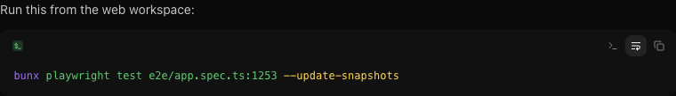

# Run commands in the terminal

In the web and desktop clients, shell code blocks in completed agent replies include a **Run in
terminal** action alongside the line-wrap and copy actions. Review the command, then select the
terminal action to open the thread's terminal and run it from the thread working directory.

T3 Code reuses the active terminal when it is idle. If that terminal has a running process, it opens
a new terminal so the command does not get typed into the existing process. The action only appears
for recognized shell fences such as `sh`, `bash`, `zsh`, and `powershell`; source-code and plain-text
blocks remain copy-only.

# Open terminal links in Preview

Commands run in a T3 Code terminal can open their browser target in the desktop Preview. This
includes development servers that support flags such as `--open`, whether they honor the standard
`BROWSER` environment variable or use the normal macOS or Linux URL launcher.

T3 Code opens the requested HTTP or HTTPS URL in the Preview panel for that terminal's thread. For
a remote environment, loopback URLs such as `http://localhost:5173` are resolved against that
environment instead of the desktop machine.

If no compatible desktop Preview is connected, T3 Code delegates the request to the server
machine's normal system browser. An explicitly configured `BROWSER` value is always preserved,
including values such as `BROWSER=none`. Explicit launcher options such as `open -a Safari` also
keep using the system launcher.
